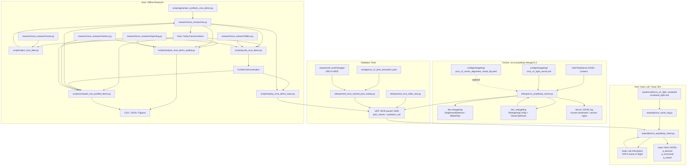

# ORCA Hand AnyTeleop IsaacLab - Software Architecture

```mermaid
flowchart TD

    %% ============================================================
    %% Online Teleoperation Pipeline
    %% ============================================================

    subgraph Docker["Docker: orca-anyteleop-retarget:0.2"]

        CAM["Intel RealSense D435i / Camera"]

        SERVER["teleop/orca_anyteleop_server.py"]

        DETECTOR["dex-retargeting<br/>SingleHandDetector / MediaPipe"]

        RETARGET_CFG["config/retargeting/<br/>orca_v2_right_vector.yml"]

        ALIGN_CFG["config/retargeting/<br/>orca_v2_vector_alignment_virtual_tip.yaml"]

        DEX["dex_retargeting<br/>RetargetingConfig + VectorOptimizer"]

        SERVER_LOG["Server JSONL log<br/>Human landmarks / vectors / qpos"]

        CAM --> SERVER

        SERVER --> DETECTOR

        RETARGET_CFG --> SERVER
        ALIGN_CFG -. optional .-> SERVER

        SERVER --> DEX
        DEX --> SERVER

        SERVER --> SERVER_LOG
    end


    %% ============================================================
    %% UDP Boundary
    %% ============================================================

    UDP["UDP JSON packet :5006<br/>joint_names + positions_rad"]

    SERVER --> UDP


    %% ============================================================
    %% Isaac Lab Host
    %% ============================================================

    subgraph IsaacHost["Host: Isaac Lab / Isaac Sim"]

        CLIENT["isaaclab/orca_anyteleop_client.py"]

        HAND_CFG["isaaclab/orca_hand_cfg.py"]

        USD["assets/usd/orca_v2_right_sanitized/<br/>orcahand_right.usd"]

        ISAAC["Isaac Lab Articulation<br/>ORCA Hand v2 Right"]

        CLIENT_LOG["Isaac Client JSONL<br/>q_desired<br/>q_command<br/>q_actual"]

        HAND_CFG --> CLIENT
        USD --> HAND_CFG

        CLIENT --> ISAAC
        ISAAC --> CLIENT

        CLIENT --> CLIENT_LOG
    end

    UDP --> CLIENT


    %% ============================================================
    %% Validation / Debug Senders
    %% ============================================================

    subgraph Validation["Validation Tools"]

        STATIC["teleop/send_orca_static_test.py"]

        SWEEP["teleop/send_orca_named_joint_sweep.py"]

        SEMANTICS["config/orca_v2_joint_semantics.yaml"]

        URDF["assets/urdf_work/retarget/<br/>ORCA URDF"]

        STATIC --> UDP

        SEMANTICS --> SWEEP
        URDF --> SWEEP
        SWEEP --> UDP
    end


    %% ============================================================
    %% Offline Research Pipeline
    %% ============================================================

    subgraph Offline["Host: Offline Research"]

        SYN["scripts/generate_synthetic_orca_demo.py"]

        INJECT["scripts/inject_orca_jitter.py"]

        PURIFY["scripts/purify_orca_demo.py"]

        ANALYZE["scripts/analyze_orca_demo_quality.py"]

        COMPARE["scripts/compare_raw_purified_demo.py"]

        REPLAY["scripts/replay_orca_demo_isaac.py"]

        IO["research/orca_research/io.py"]

        NOISE["research/orca_research/noise.py"]

        FILTERS["research/orca_research/filters.py"]

        METRICS["research/orca_research/metrics.py"]

        REPORT["research/orca_research/reporting.py"]

        RAW["Raw / Noisy Demonstration"]

        CLEAN["Purified Demonstration"]

        RESULTS["CSV / JSON / Figures"]


        SYN --> IO
        IO --> RAW

        RAW --> INJECT
        NOISE --> INJECT
        INJECT --> IO

        RAW --> ANALYZE
        IO --> ANALYZE
        METRICS --> ANALYZE
        REPORT --> ANALYZE

        RAW --> PURIFY
        IO --> PURIFY
        FILTERS --> PURIFY
        PURIFY --> CLEAN
        REPORT --> PURIFY

        RAW --> COMPARE
        CLEAN --> COMPARE
        IO --> COMPARE
        METRICS --> COMPARE
        REPORT --> COMPARE

        ANALYZE --> RESULTS
        COMPARE --> RESULTS

        CLEAN --> REPLAY
        IO --> REPLAY
    end

    REPLAY --> UDP
```